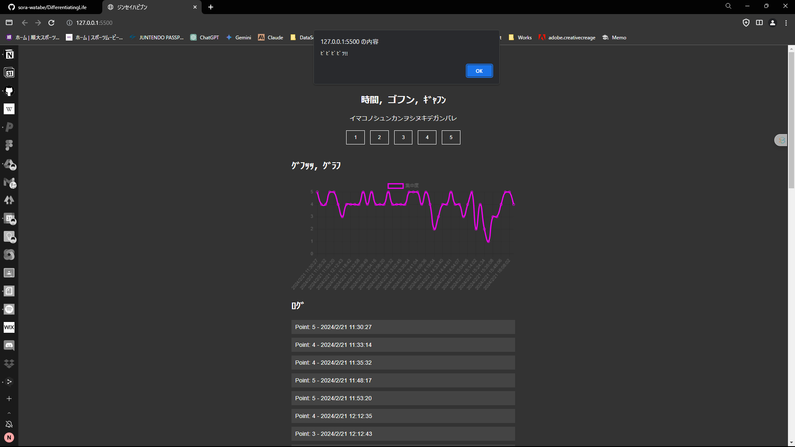

# DifferentiatingLife

## Demo

An alarm goes off every 5 minutes to check your current level of concentration.

## Overview

This is a simple web app that allows users to track their concentration levels over time. Designed with HTML, CSS, and JavaScript, it provides an interactive experience where users can log their focus scores, which are then displayed on a graph.

## Features

- Log concentration scores with corresponding timestamps
- Visualize scores in real-time with a dynamic line chart
- Audio alerts at regular intervals to remind users to log their score
- Data persistence through local storage

## Getting Started

Clone the repository and open `index.html` in your browser to start logging your scores.
